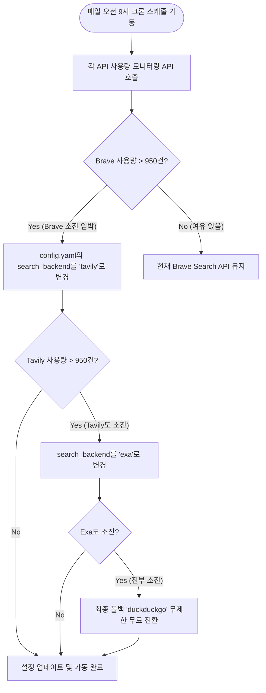

# 🔍 AI 에이전트 검색 비용 $0 만들기: 무료 검색 API 3,000건 로테이션 전략

본 가이드는 AI 에이전트(헤나, AG 등)의 실시간 웹 검색 기능(Tavily, Brave, Exa)을 월 3,000건까지 비용 지출 없이($0) 안정적으로 유지하는 실전 아키텍처와 활용법을 정리한 가이드입니다. 

이 자료는 마스터님의 신규 강의 및 전자책 콘텐츠용 소재(가성비 AI 인프라 구축 트랙)로도 활용이 가능합니다.

---

## 1. 3대 검색 API 기술 및 특징 비교

각 API는 검색 인덱스 설계 및 정제 아키텍처가 완전히 다르므로, 상황에 맞게 최적의 백엔드를 선택하는 것이 중요합니다.

| 분류 | **Brave Search API** 🦁 | **Tavily API** 🌐 | **Exa API (구 Metaphor)** ☄️ |
| :--- | :--- | :--- | :--- |
| **핵심 컨셉** | 독립형 고속 웹 인덱스 검색 | LLM 맞춤형 정제 검색 엔진 | 신경망 기반 문맥/링크 검색 |
| **인덱스 규모** | 400억 개 이상의 독립 페이지 | 검색 제휴 및 자체 필터링 | 신경망 임베딩 기반 웹 그래프 |
| **최적 용도** | 최신 뉴스, 일반 지식, 빠른 응답 속도 | 토큰 절약, 환각(Hallucination) 방지 | 논문 리서치, 심층 개념 분석 |
| **무료 제공량** | **월 1,000건** (카드 등록 불필요) | **월 1,000건** (카드 등록 불필요) | **월 1,000건** (카드 등록 불필요) |
| **최대 강점** | 독자적인 검색 인덱스로 검열 없음 | 본문 텍스트 요약 및 정제본 제공 | 자연어 질문 및 링크 기반 검색 우수 |
| **API 키 발급** | [api.search.brave.com](https://api.search.brave.com/) | [tavily.com](https://tavily.com/) | [exa.ai](https://exa.ai/) |

---

## 2. 월간 무료 사용량 계산 및 설계

일반적인 1인 에이전트의 일일 검색 패턴을 고려할 때, 월 3,000건은 개인용 및 소규모 비즈니스용 개발에 차고 넘치는 용량입니다.

$$\text{일일 허용 검색량} = \frac{3,000 \text{건 (전체 무료 한도)}}{30 \text{일}} = 100 \text{건/일}$$

*   **일평균 100회**의 웹 검색 호출이 가능하며, 이는 1명의 개발자가 하루 종일 디버깅을 돌려도 소진하기 어려운 충분한 용량입니다.
*   **백업(비상용) 채널**: 3대 API가 모두 소진되거나 오류 발생 시, 무제한 무료인 **DuckDuckGo** 엔진으로 자동 전환되도록 폴백(Fallback)을 설계합니다.

---

## 3. 크론(Cron) 기반 자동 로테이션 시스템 구조

Tavily 크레딧 소진(432 에러)과 같은 비상 상황 시 에이전트가 중단되지 않도록, 사용량을 실시간으로 체크하여 백엔드를 스왑하는 경량 로테이션 시스템 구조입니다.



---

## 4. 에이전트 수동/자동 설정 가이드

### ① API 키 발급 및 환경 변수 등록
각 공식 홈페이지에서 발급받은 API 키를 마스터님의 로컬 `.env` 파일에 다음과 같이 추가합니다.

```bash
# ~/초보프로젝트/.env
BRAVE_SEARCH_API_KEY=YOUR_BRAVE_KEY_HERE
TAVILY_API_KEY=YOUR_TAVILY_KEY_HERE
EXA_API_KEY=YOUR_EXA_KEY_HERE
```

### ② 에이전트 설정 파일 반영
헤나(Hermes)의 전용 설정 파일(`~/.hermes/config.yaml`)에 백엔드 기본값을 설정합니다.

```yaml
# ~/.hermes/config.yaml
web:
  search_backend: 'brave-free'  # brave-free, tavily, exa, duckduckgo 중 지정
  max_results: 5
```

이 로테이션 시스템을 활용하면 비용 청구의 우려 없이 실시간 검색이 가능한 강력한 AI 코딩 환경을 상시 구축할 수 있습니다.
